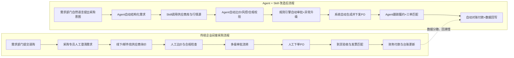

# Test

## 传统企业间接采购流程 vs Agent + Skill 改造流程（对比分析图）

## 核心差异对比

| 维度 | 传统间接采购 | Agent + Skill 改造后 |
|---|---|---|
| 需求处理 | 人工反复沟通，口径不一 | Agent自动提取品类、预算、时效、规则 |
| 寻源询价 | 靠经验找供应商，覆盖有限 | Skill并行调用供应商池与历史成交数据 |
| 比价与风控 | Excel为主，易漏项 | 自动化评分（价格、交期、资质、风险） |
| 审批效率 | 串行审批，等待时间长 | 标准场景自动审批，异常自动升级 |
| 执行与跟踪 | 人工催单、被动跟进 | Agent主动预警延期、缺货、超预算 |
| 结算对账 | 人工核对，错误率较高 | 三单自动匹配，异常自动分派 |
| 数据沉淀 | 系统割裂，复盘困难 | 全链路数据可追踪，持续优化策略 |

## 效果评估（示例）

- 采购周期：可从 **7–15天** 缩短到 **1–3天**（标准品类）。
- 询价覆盖：供应商触达数可提升 **2–5倍**。
- 人工工作量：采购运营重复性动作可下降 **40%–70%**。
- 合规性：合同与供应商资质漏检率显著下降。

> 适合先在 MRO、办公用品、IT配件、行政服务等高频低战略品类试点，再逐步扩展到更多间接采购场景。
